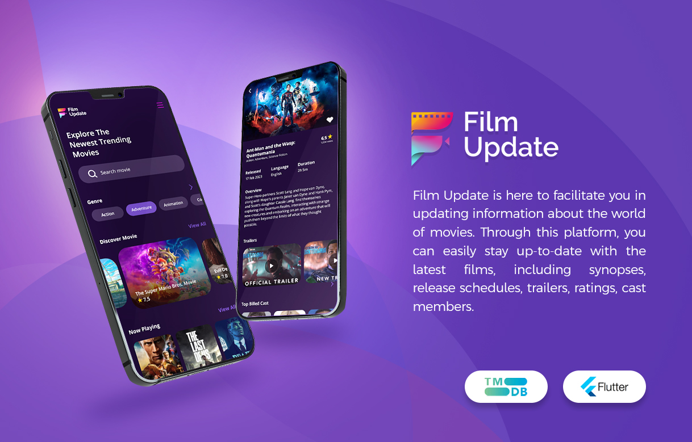

# 🍿🎬 Film Update 

This project belong to personal mini project on 
**Alterra Academy flutter front end enginer.**

Star⭐ the repo if you like what you see😉.

## 📸 ScreenShots

| 1 | 2|
|------|-------|
|||

| 3 | 4|
|------|-------|
|||

## 🎯 Key feature
* searching movie
* get popular movie 
* get up comming movie
* get discover movie
* get now playing movie
* get all movie by genre
* using infinite scrolling pagination
* see details movie
* play trailer movie and get recomendation by movie was choose
* add movie to favorite list

## ✨ Requirements
* Any Operating System
* Min android sdk version 17
* A brain to think 🤓🤓

## 🤓 Author(s)
[**HyIamJu**](https://github.com/HyIamJu)

if you want use the project please use your own apikey and dont use the logo was I made.

## Getting Started

This project is a starting point for a Flutter application.

for use this project you need to get your own movieDb apikey.
more info you can see on [**MovieDb web**](https://developers.themoviedb.org/3/getting-started/introduction)

1. fork this repository
2. go to file film_update_mobile_apps/lib/utils/app_constant.dart
3. change apikey string to your own apikey from movieDb
4. pub get all dependency
5. save and run the project
6. enjoyy 😋😊
